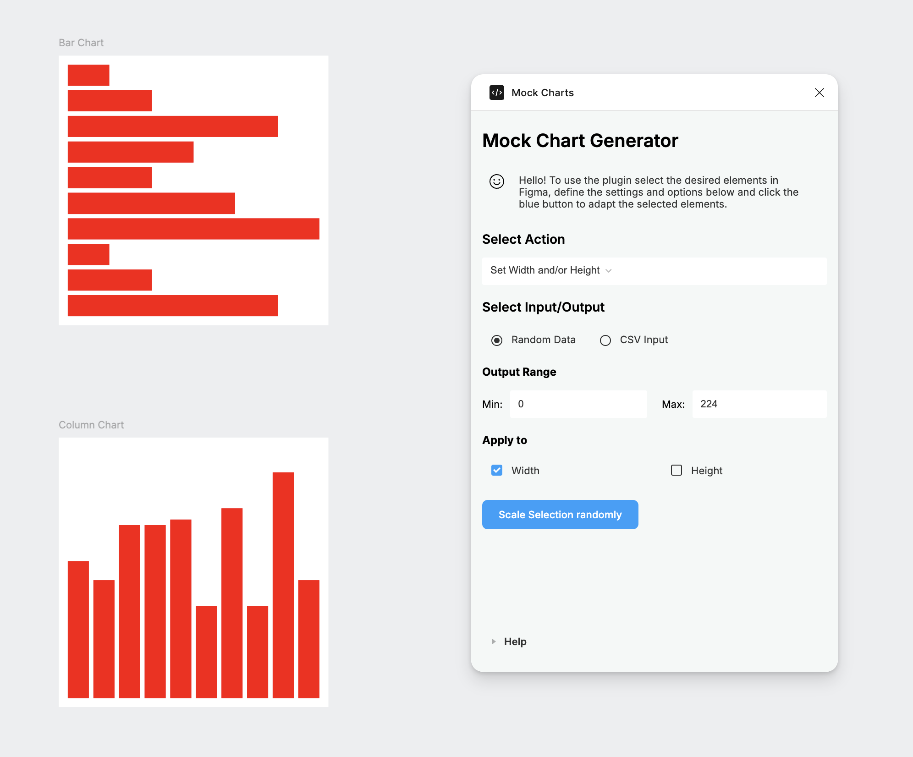
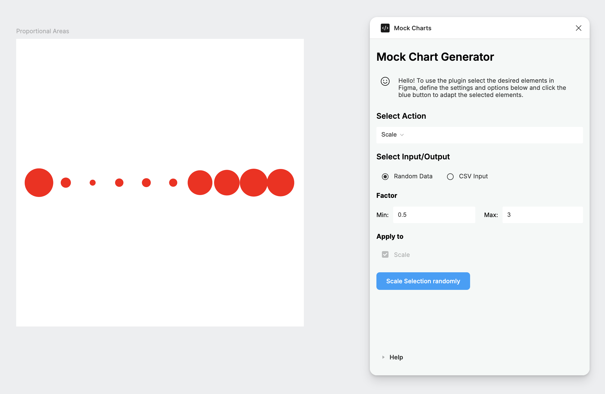
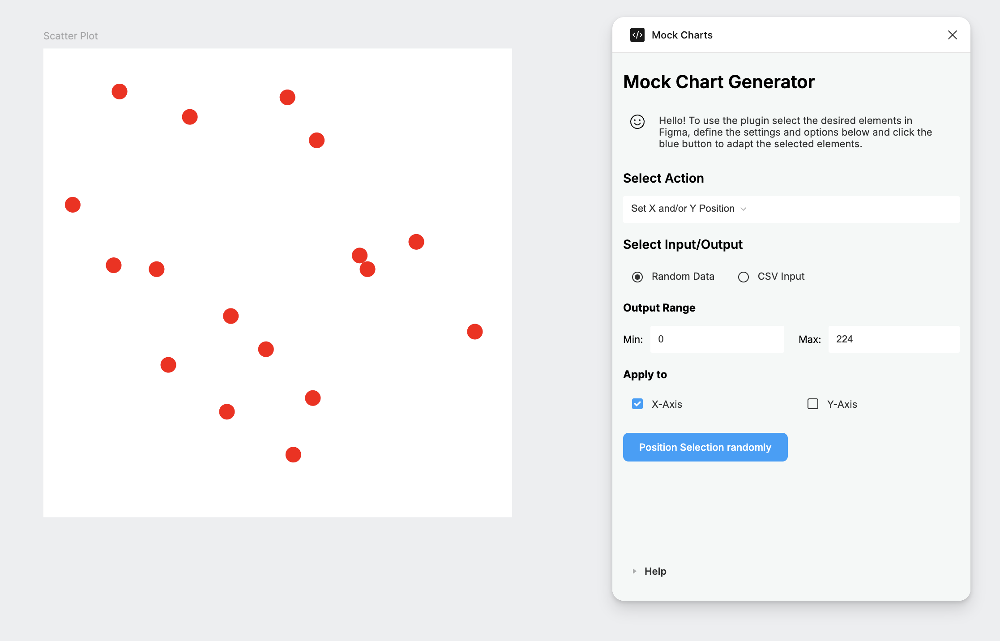
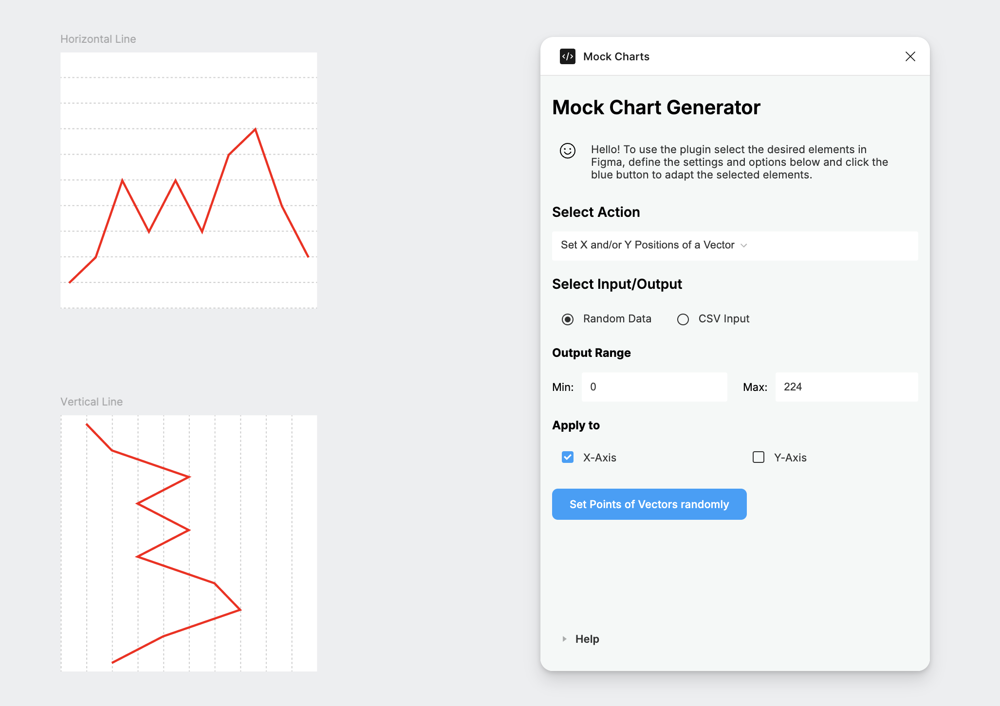
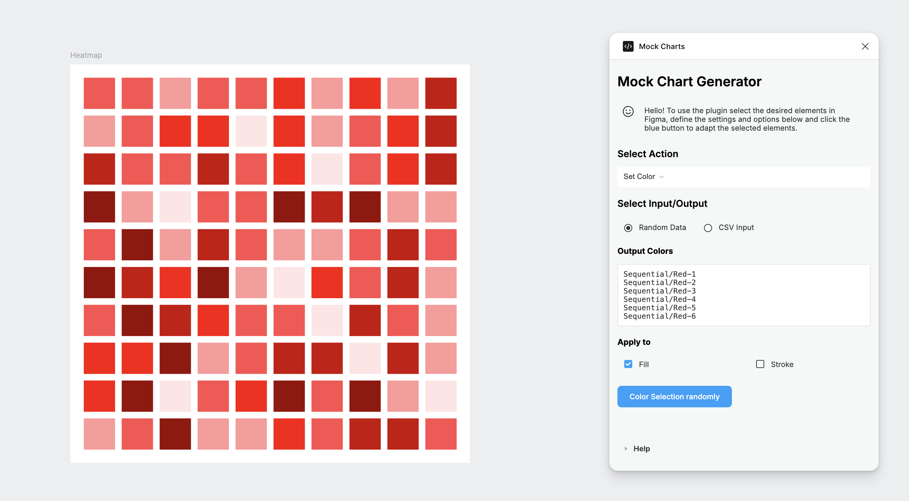
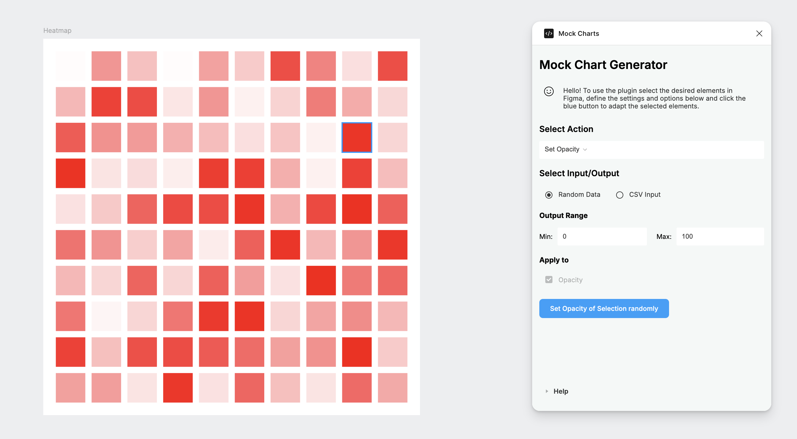

# Mock Data Chart Figma Plugin

The following Figma Plugin uses [figma-plugin-ds](https://github.com/thomas-lowry/figma-plugin-ds) and the standard Figma API to adapt selected elements in Figma according to random or Mock Data.

## How to dev

1. Download the code from this repo and run `npm install`
2. Start the compiler to auto-compile the .js files when changes are applied: `npm run build -- --watch`

## Current Features 

### Set Width and/or Height

### Scale

### Set X and/or Y Position

### Set X and/or Y Positions of a Vector

### Set Color

### Set Opacity

